# 🌲 SurvivalCalc (Калькулятор Автономного Похода)

<p align="center">
  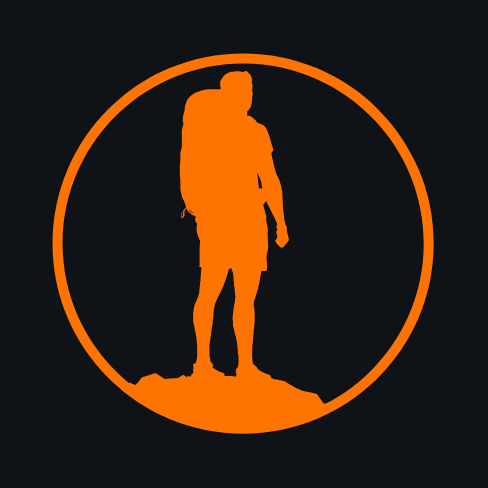
</p>

<p align="center">
  <strong>Профессиональный офлайн-калькулятор походного рациона, снаряжения, полевой GPS-навигации, кэширования карт и вечернего дебрифинга для туристов, легкоходов и выживальщиков.</strong>
</p>

<p align="center">
  
  
  
  
  
  
  
  <a href="https://keepandroidopen.org/ru/">
    
  </a>
</p>

<p align="center">
  <a href="https://kobaltgit.github.io/SurvivalCalc/">
    
  </a>
  &nbsp;&nbsp;
  <a href="https://github.com/kobaltgit/SurvivalCalc/releases/latest">
    
  </a>
</p>

---

## 📸 Галерея экранов приложения

### 1. Настройка похода, группа и профиль маршрута
<table>
  <tr>
    <td align="center" width="33%">
      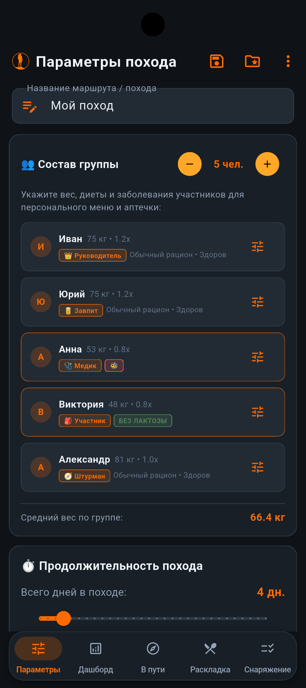<br />
      <b>Состав группы, роли и здоровье</b>
    </td>
    <td align="center" width="33%">
      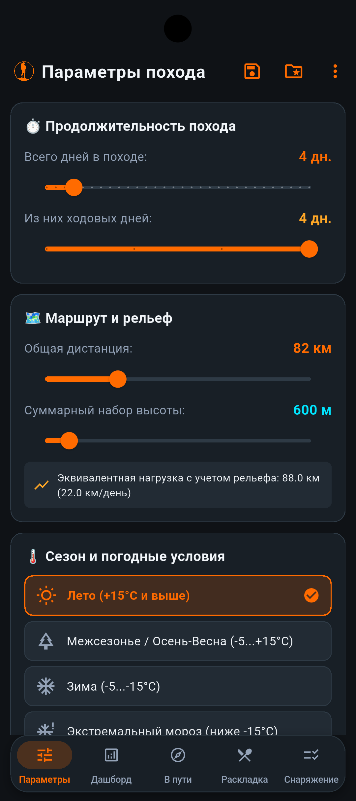<br />
      <b>Дистанция, рельеф и сезон</b>
    </td>
    <td align="center" width="33%">
      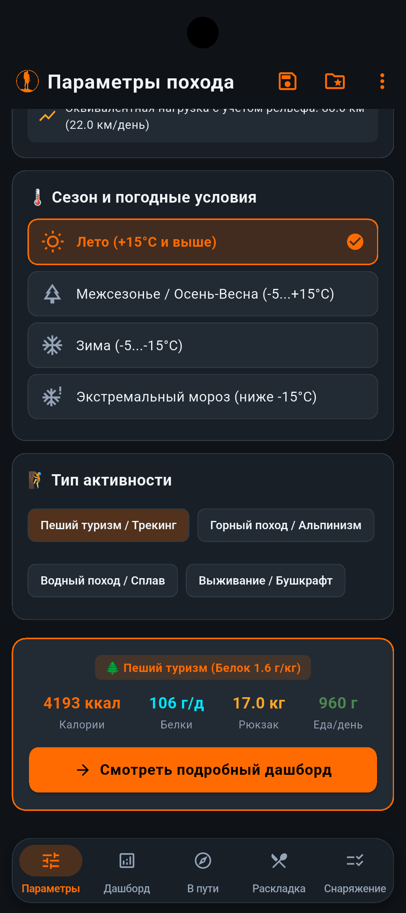<br />
      <b>Тип активности и экспресс-сводка</b>
    </td>
  </tr>
</table>

---

### 2. Дашборд, графики и развесовка груза
<table>
  <tr>
    <td align="center" width="25%">
      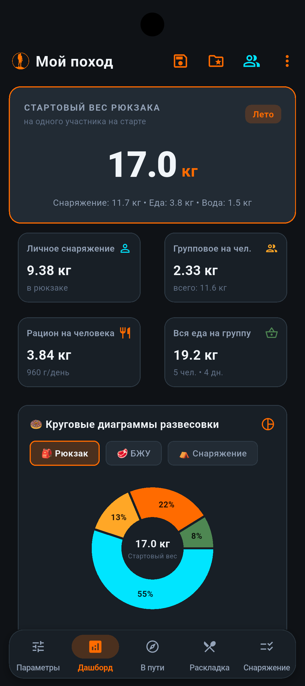<br />
      <b>Стартовый вес рюкзака</b>
    </td>
    <td align="center" width="25%">
      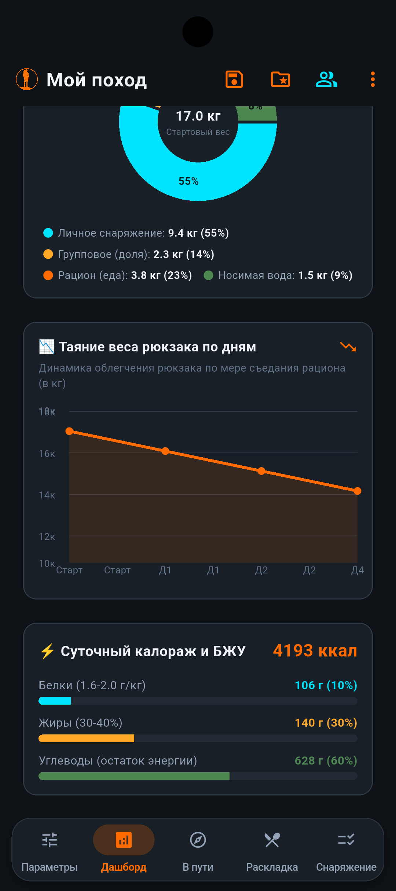<br />
      <b>График таяния и БЖУ</b>
    </td>
    <td align="center" width="25%">
      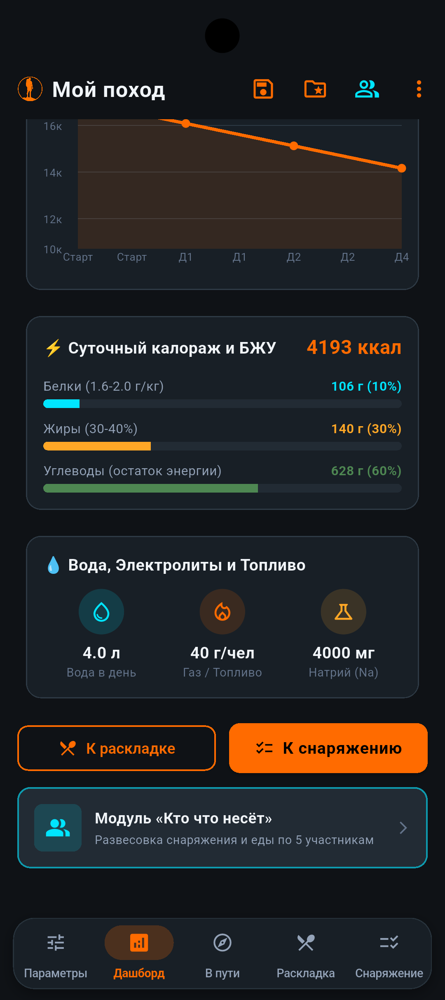<br />
      <b>Вода, натрий и топливо</b>
    </td>
    <td align="center" width="25%">
      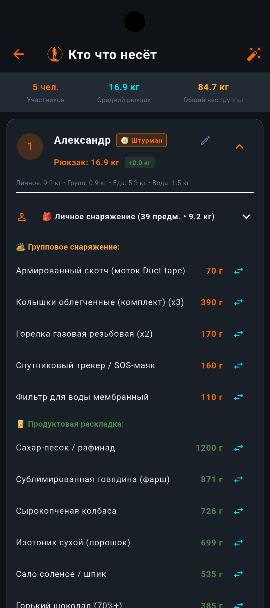<br />
      <b>Развесовка «Кто что несёт»</b>
    </td>
  </tr>
</table>

---

### 3. Полевая GPS-навигация («В пути»)
<table>
  <tr>
    <td align="center" width="33%">
      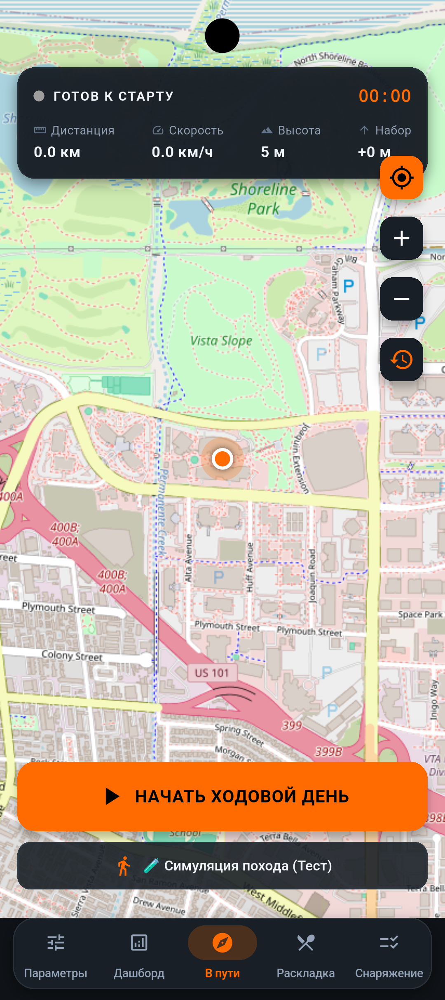<br />
      <b>Офлайн-карта и тактический HUD</b>
    </td>
    <td align="center" width="33%">
      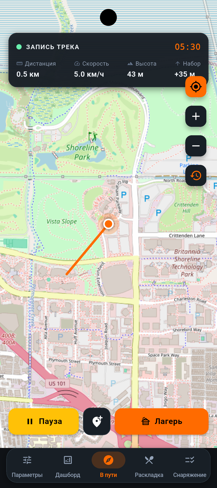<br />
      <b>Запись трека и скорость</b>
    </td>
    <td align="center" width="33%">
      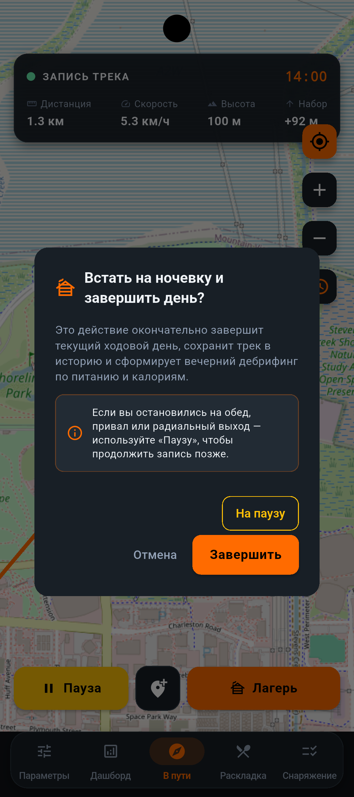<br />
      <b>Завершение дня и подсказка «На паузу»</b>
    </td>
  </tr>
</table>

---

### 4. Вечерний лагерь (Camp Debrief) и история треков
<table>
  <tr>
    <td align="center" width="33%">
      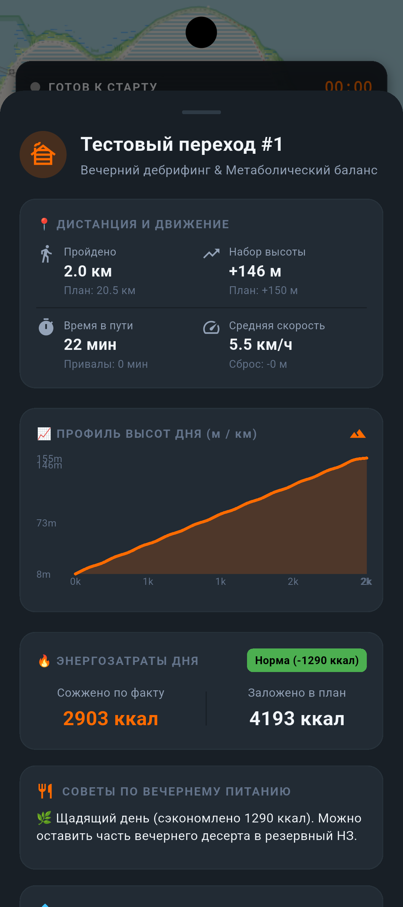<br />
      <b>Профиль высот и факт vs план</b>
    </td>
    <td align="center" width="33%">
      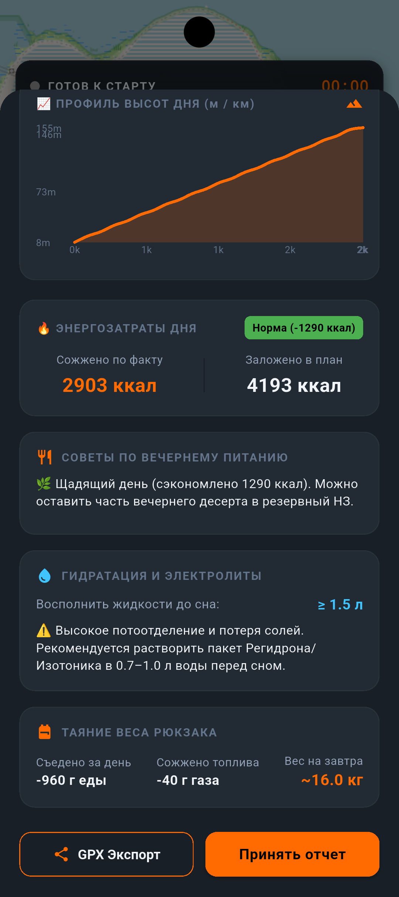<br />
      <b>Водно-солевой баланс и GPX экспорт</b>
    </td>
    <td align="center" width="33%">
      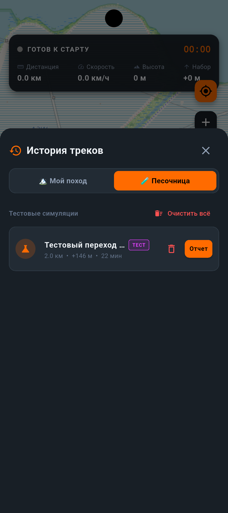<br />
      <b>История треков и 🧪 Песочница</b>
    </td>
  </tr>
</table>

---

### 5. Продуктовая раскладка и чек-лист снаряжения
<table>
  <tr>
    <td align="center" width="33%">
      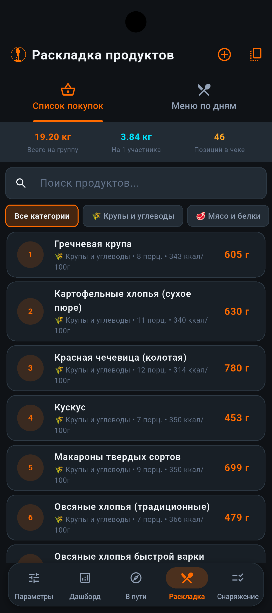<br />
      <b>Сводный список покупок</b>
    </td>
    <td align="center" width="33%">
      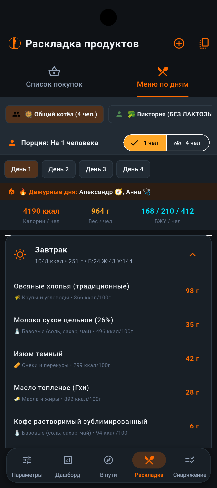<br />
      <b>Меню по дням и дежурные</b>
    </td>
    <td align="center" width="33%">
      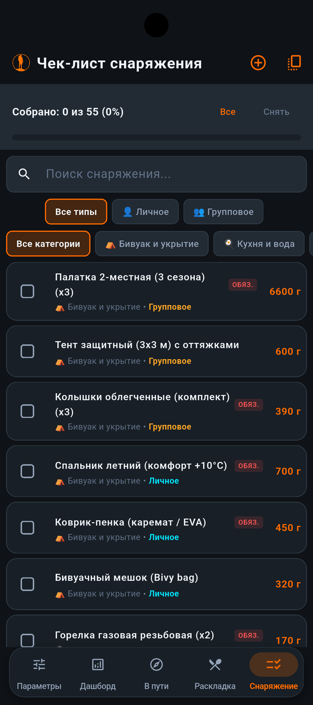<br />
      <b>Чек-лист снаряжения</b>
    </td>
  </tr>
</table>

---

### 6. Библиотека походов и офлайн QR-синхронизация
<table>
  <tr>
    <td align="center" width="20%">
      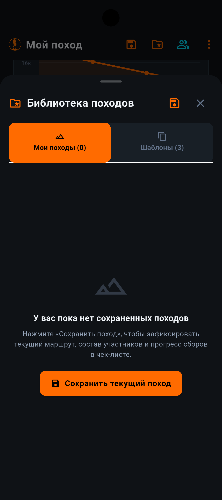<br />
      <b>Сохранение в «Мои походы»</b>
    </td>
    <td align="center" width="20%">
      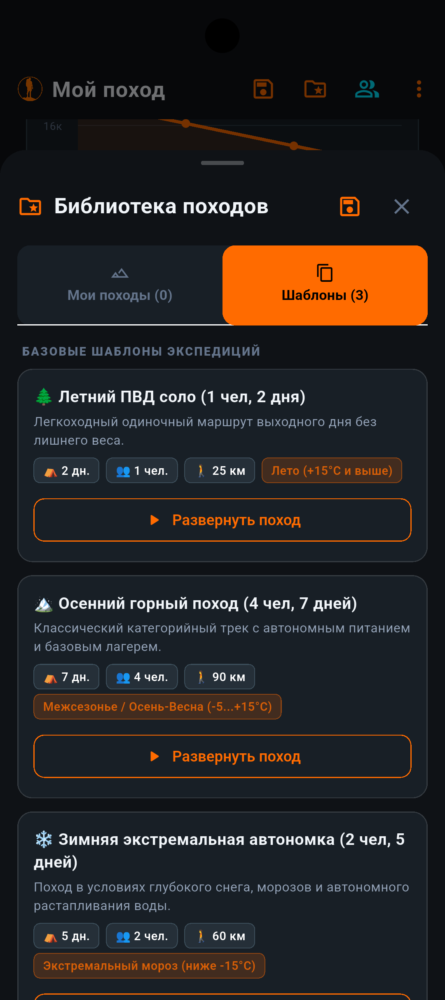<br />
      <b>Шаблоны готовых походов</b>
    </td>
    <td align="center" width="20%">
      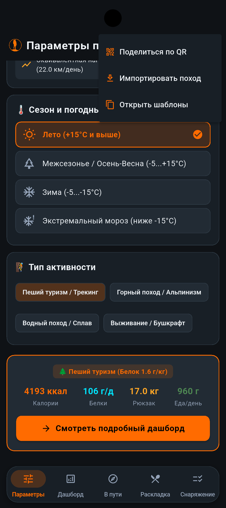<br />
      <b>Меню синхронизации</b>
    </td>
    <td align="center" width="20%">
      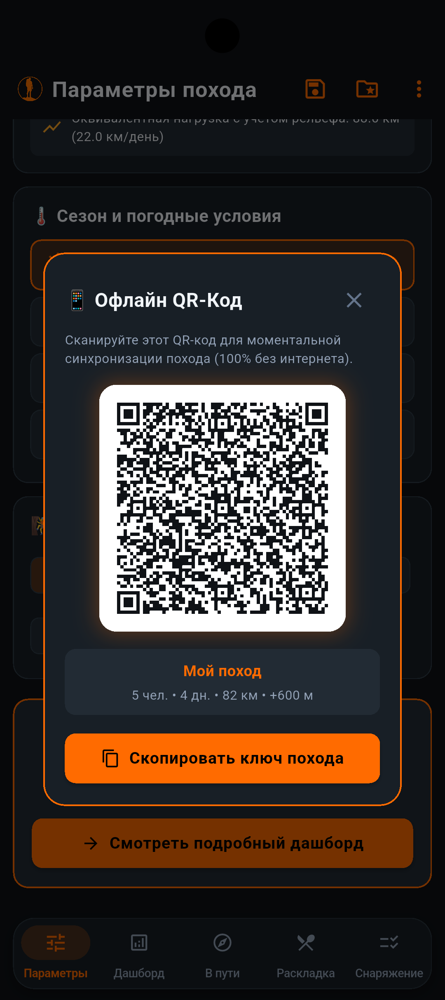<br />
      <b>Генерация QR-кода</b>
    </td>
    <td align="center" width="20%">
      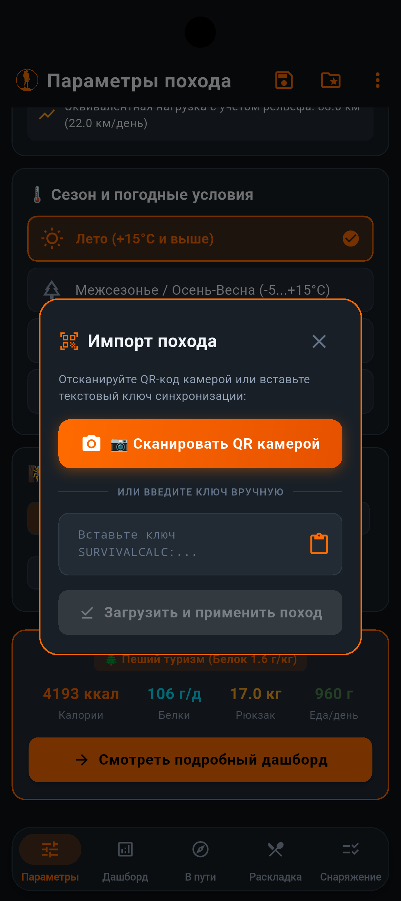<br />
      <b>Импорт и сканер камеры</b>
    </td>
  </tr>
</table>

---

## 📖 О проекте

**SurvivalCalc** — профессиональное мобильное приложение на Flutter, спроектированное для безотказной работы в условиях **100% автономности (в режиме полёта / при полном отсутствии интернета и сотовой связи)**. 

Оно решает весь спектр задач подготовки и прохождения экспедиции:
1. **Расчет физиологических потребностей:** индивидуальный и групповой BMR/TDEE с учетом рельефа, типа активности и температурных условий (холода).
2. **Генерация продуктовой раскладки:** автоматический подбор меню по дням, граммам и 4 слотам питания с контролем калорий, БЖУ, соли и микроэлементов.
3. **Формирование чек-листа снаряжения:** интеллектуальный фильтр сезонности с расчетом стартового веса рюкзака.
4. **Справедливое распределение груза («Кто что несёт»):** балансировка группового веса с учетом коэффициента физической силы, походных должностей и графика дежурств.
5. **Импорт GPX-маршрутов:** загрузка любых треков с авто-подстановкой реального километража и высот, а также встроенный эталонный горный трек «Легендарная Тридцатка (Кавказ)».
6. **Кэширование офлайн-карт:** предзагрузка тайлов OpenStreetMap / CARTO по радиусу вокруг лагеря или вдоль коридора планируемого маршрута.
7. **Полевой GPS-трекинг:** запись трека на карте, тактический HUD со скоростью, высотой и временем движения, расстановка путевых меток.
8. **Вечерний дебрифинг (Camp Debrief):** сравнение факта с планом, динамический пересчет TDEE, рекомендации по закрытию углеводно-жирового окна, гидратации и экспорт трека в GPX 1.1.

---

## ✨ Ключевые возможности

### 1. 🧠 Метаболический двигатель (Metabolic Engine)
- **Базовый метаболизм (BMR)** по формуле Миффлина — Сан Жеора:
  $$\text{BMR} = 10 \times \text{вес (кг)} + 6.25 \times 175 - 5 \times 30 + 5$$
- **Эквивалентная дистанция (поправка на рельеф):**
  $$\text{Distance}_{eq} = \text{Distance}_{\text{км}} + \frac{\text{Ascent}_{\text{м}}}{100}$$
- **Коэффициент физической активности (PAL):**
  - $< 12\text{ км/день} \rightarrow \text{PAL} = 1.8$
  - $12\text{--}20\text{ км/день} \rightarrow \text{PAL} = 2.2$
  - $> 20\text{ км/день}$ или режим *Survival* $\rightarrow \text{PAL} = 2.6$
- **Поправка на холод:**
  - Зима (`winter`): $+500\text{ ккал/день}$
  - Экстремальный мороз (`extreme_cold`): $+1000\text{ ккал/день}$
- **Дифференциация по типам активности:** пеший туризм, горный поход ($+250\text{ ккал}$), водный поход ($+150\text{ ккал}$), выживание.
- **Целевые нормы:** Белки ($1.5\text{--}2.0\text{ г/кг}$), Жиры ($30\%\text{--}40\%$), Углеводы (остаток), Натрий ($2500\text{--}4000\text{ мг}$), Вода ($2.5\text{--}4.5\text{ л}$), Топливо ($40\text{--}100\text{ г/чел/день}$).

---

### 2. 🥫 Продуктовая раскладка (Food Breakdown)
- **Встроенная база данных:** 57 продуктов со всеми нутриентами (калории, БЖУ, калий, магний, натрий, железо, витамин C, вес порции, срок хранения).
- **4 слота питания:** Завтрак, Обед-перекус, Ужин, Карманное питание (Fast Fuel).
- **Сводный список покупок:** точный вес каждого продукта с учетом размера группы и длительности похода.
- **Интерактивный масштаб раскладки:** переключатель `[ 👤 1 чел ]` (разовая порция) / `[ 👥 N чел ]` (суммарная закладка в котёл на группу).
- **Гарантированная норма соли:** автоматическое включение 10 г/чел/день поваренной соли для водно-солевого баланса.
- **Пользовательские продукты:** возможность добавлять свои продукты с авто-сохранением в локальное хранилище.

---

### 3. 🎒 Модульный чек-лист снаряжения (Gear Checklist)
- **Встроенная база снаряжения:** 66 позиций в 8 категориях (`shelter`, `cooking`, `tools`, `electronics`, `med_hygiene`, `clothing`, `packs`, `winter`).
- **Сезонный фильтр:** интеллектуальное исключение зимнего снаряжения летом и автоматическое добавление снегоступов, лавинных лопат и штормовых палаток зимой.
- **Интерактивные чекбоксы сборов:** мгновенный пересчет собранного веса, статусы «Личное / Групповое» и фильтрация по категориям.

---

### 4. 👥 Развесовка «Кто что несёт», роли и график дежурств
- **Коэффициент физической силы:** справедливое распределение группового веса в процентах (например, мужчины 1.2x, девушки 0.8x).
- **Походные должности (`TripRole`):**
  - 👑 **Руководитель** — навигация, спутниковый трекер.
  - 🩺 **Медик** — групповая аптечка.
  - 🔧 **Реммастер** — групповой ремнабор.
  - 🥫 **Завпит** — контроль продуктового баланса.
  - 🧭 **Штурман** — карты и компас.
  - 🎒 **Участник** — распределение палаток, котлов и продуктов.
- **График дежурств (`Duty Roster`):** циклическая ротация пар дежурных по дням с отображением плашки в меню.
- **Индивидуальный учет здоровья:** персонализированное назначение медикаментов (ингалятор при астме, эластичные бинты при больных суставах) и спецдиет.

---

### 5. 🗺️ Импорт планируемых GPX-маршрутов
- **Загрузка любых GPX-треков:** импорт файлов со смартфона через системный файловый диалог (`file_picker`, `xml`).
- **Авто-парсинг и геометрия:** высокоточный 3D Haversine расчет суммарной дистанции, набора и сброса высоты, количества путевых точек и стоянок с отсечением шумов.
- **Авто-заполнение параметров:** кнопка в 1 клик переносит реальную дистанцию и набор высоты из GPX прямо в профиль похода.
- **Встроенный эталонный маршрут «Тридцатка» (`demo_route_30.gpx`):** легендарный всесоюзный маршрут №30 через плато Лагонаки, приют Фишт и перевал Белореченский к Солох-Аулу (~48 км, +1650м набора) для мгновенного знакомства с функционалом.

---

### 6. 📥 Менеджер офлайн-карт и кэширование тайлов (Tile Caching)
- **Полная автономность:** предварительная загрузка фрагментов топографической карты Esri World Topo Map / OpenTopoMap в локальное дисковое хранилище приложения.
- **Два режима кэширования:**
  1. *Круговой радиус (5 — 50 км)* вокруг текущей геопозиции или лагеря (Zoom 10..15).
  2. *Буферный коридор трека (±1..5 км)* вдоль всей нитки планируемого GPX-маршрута.
- **Калькулятор Slippy Map (`TileMathUtils`):** точный предварительный расчет количества тайлов и объема загрузки в мегабайтах перед стартом.
- **Многопоточный загрузчик (`OfflineTileDownloader`):** фоновое скачивание с индикатором прогресса, скоростью загрузки и возможностью отмены.
- **Безотказный `CachedTileProvider`:** автоматическое чтение сохраненных тайлов из дискового кэша, работа без ключей и ограничений на базе Akamai CDN (**Esri World Topo Map** с высотами, изолиниями и горным рельефом), валидация magic-bytes изображений.
- **Управление регионами:** просмотр списка сохраненных зон, занятого дискового пространства и быстрая очистка кэша.

---

### 7. 🛰️ Полевой GPS-трекинг и картография («В пути»)
- **Интерактивная офлайн-карта** на базе `flutter_map` и `latlong2`.
- **Наложение планового трека:** контрастная неоновая полилиния маршрута (Cyan polyline) и маркеры перевалов / стоянок поверх карты.
- **Живой тактический HUD:** скорость движения, текущая высота, набор/сброс, время хода и пройденное расстояние.
- **Путевые точки (Waypoints):** возможность ставить метки (лагерь, родник, брод, вершина, опасность).
- **Экспорт в GPX 1.1:** выгрузка полноценного трека со всеми точками высот и времени через системный шеринг.

---

### 8. ⛺ Вечерний лагерь (Camp Debrief)
- **План vs Факт:** сравнение запланированного и фактически пройденного километража и высоты.
- **Динамический пересчет TDEE:** точный расчет сожженных калорий с учетом фактического профиля высоты.
- **Метаболические советы:** закрытие углеводно-жирового окна, объем воды на вечер и рекомендации по электролитам (Регидрон/Изотоник).
- **Интерактивый график профиля высот** на базе `fl_chart`.

---

### 9. 🧪 Изолированная «Песочница» (Sandbox)
- Специальный полигон для безопасного тестирования навигации и симуляции походов.
- Все тестовые треки изолированы (`DailyTrack.sandboxTripId`) и не искажают историю реальных экспедиций.
- Ускоренная симуляция (1 сек = 30 сек похода, честные $4.8\text{ км/ч}$).
- Кумулятивный dead-band фильтр шума в `DistanceCalculator`, сохраняющий каждый реальный шаг.
- Управление треками: точечное удаление с диалогом подтверждения и кнопка быстрой очистки песочницы.

---

### 10. 📲 Офлайн-синхронизация по QR-коду и библиотека походов
- **Встроенный Live Camera QR-сканер** на базе `mobile_scanner` с тактическим видоискателем и фонариком.
- **Компактные Base64 QR-коды** для мгновенной передачи паспорта похода между смартфонами без интернета.
- **Сквозная синхронизация участников:** полный перенос анкет группы (ФИО, опыт, контакты, роли, веса, диеты и медицинские показания) в один скан.
- **Библиотека «Мои походы»:** сохранение походов, дублирование, экспорт и готовые системные пресеты (Летний ПВД соло, Осенний Кавказ 4 чел, Зимняя автономка 2 чел).

---

### 11. 📄 Экспорт отчетов по стандартам МКК и экспедиционных архивов
- **Два официальных формата туристской отчетности:**
  1. 📕 **Предпоходный паспорт (Маршрутная книжка / Заявка в МКК):**
     - Титульный лист с категорией сложности, регионом, организацией, МКК и аварийными путями схода.
     - Состав группы с должностями, туристским опытом, контактами, диетами и здоровьем.
     - Автоматическая развесовка снаряжения («Кто что несёт») и сбалансированная продуктовая раскладка.
  2. 📗 **Итоговый технический отчет о походе:**
     - Сводная аналитика «План vs Факт» (дистанция, набор высоты, дни, ходовое время).
     - График фактического движения по дням на основе записанных GPS-треков.
     - Паспорт путевых точек и препятствий (высота, координаты, описание, фото).
     - Дневник лагеря и метеорологические наблюдения с вечерних дебрифингов.
- **Мультиформатный экспорт (100% Offline):**
  - 📑 **Печать / PDF:** типографская A4 верстка с оглавлением, встроенным кириллическим шрифтом Roboto (полная автономность, просмотр в браузере без CORS).
  - 📝 **Markdown (`.md`):** структурированный текст для баз знаний и репозиториев.
  - 🌐 **HTML / Word (`.html`):** стилизованный UTF-8 документ для мгновенного копирования или прямого открытия в **Microsoft Word** с сохранением таблиц и стилей.
  - 📦 **Экспедиционный ZIP-архив:** выгрузка полного комплекта похода (PDF-отчет, Markdown, HTML, все GPX-треки и фотографии путевых меток).

---

### 12. 🌙 Тактический интерфейс (Outdoor UI)
- **High-Contrast Dark Theme:** глубокий темный фон (`#121417`), сигнальный оранжевый акцент (`#FF6B00`), высокая читаемость на ярком солнце.
- **Полноэкранный режим (Immersive Sticky):** скрытие системной панели Android и статус-бара для 100% полезного пространства.
- **Плавающий док (Floating Pill Dock):** нижняя панель навигации парит над экраном с отступами и скруглением $R=20\text{px}$, исключая задевание скруглений дисплея.

---

## 🏗️ Архитектура и структура проекта

Проект построен по принципам **Clean Architecture** и **Feature-First**:

```
lib/
├── core/
│   ├── enums/             # TripEnums (сезоны, активности, роли, категории, диеты, здоровье)
│   ├── services/          # QrSyncService, FileSaverService (Web & Mobile)
│   ├── theme/             # OutdoorTheme (Material 3 Dark Palette)
│   └── widgets/           # AppLogo, QrScannerDialog
├── features/
│   ├── calculator/        # Доменный калькулятор TDEE, BMR и провайдеры
│   ├── dashboard/         # Дашборд, график таяния рюкзака, круговые диаграммы
│   ├── gear/              # Чек-лист снаряжения, фильтры, категории
│   ├── group_distribution/# Развесовка груза, роли, график дежурств
│   ├── home/              # Главный экран с плавающей навигацией
│   ├── mkk_reports/       # Генерация отчетов МКК (PDF, Markdown, HTML, ZIP)
│   │   ├── domain/        # MkkPdfGenerator, MkkMarkdownGenerator, ExpeditionArchiveService
│   │   └── presentation/  # MkkExportSheet, MkkSettingsDialog
│   ├── ration/            # Продуктовая раскладка, меню по дням, кастомные продукты
│   ├── tracking/          # GPS-трекер, карты flutter_map, Camp Debrief, песочница
│   │   ├── data/          # TrackStorageRepository, OfflineTileRepository, OfflineTileDownloader
│   │   ├── domain/        # GpsPoint, DailyTrack, CampDebrief, GpxRouteParser, TileMathUtils
│   │   └── presentation/  # TrackingScreen, CampDebriefSheet, OfflineMapsSheet, PlannedRouteProviders
│   ├── trip_setup/        # Wizard создания похода, ввод параметров, PlannedRouteCard
│   └── trip_storage/      # Библиотека походов, шаблоны, сохранение
└── main.dart              # Точка входа, полноэкранный режим, инициализация
```

---

## 🛠️ Стек технологий

| Компонент | Библиотека / Технология |
| :--- | :--- |
| **Фреймворк** | Flutter 3.44+ / Dart 3.x (Null Safety) |
| **Архитектура** | Clean Architecture / Feature-First |
| **Стейт-менеджмент** | Riverpod (`flutter_riverpod: ^2.6.1`) |
| **Графика и чарты** | FL Chart (`fl_chart: ^1.2.0`) |
| **Картография** | Flutter Map (`flutter_map: ^8.2.2`, `latlong2: ^0.9.1`) |
| **Геолокация** | Geolocator (`geolocator: ^14.0.2`) |
| **Генерация PDF** | PDF (`pdf: ^3.11.3`), Printing (`printing: ^5.14.2`) |
| **Архивация** | Archive (`archive: ^4.0.7`) |
| **GPX и XML парсинг** | XML (`xml: ^6.5.0`) |
| **Импорт файлов** | File Picker (`file_picker: ^12.1.2`) |
| **Сетевой загрузчик** | HTTP (`http: ^1.2.2`) |
| **QR-сканер** | Mobile Scanner (`mobile_scanner: ^7.4.0`), QR Flutter (`qr_flutter: ^4.1.0`) |
| **Локальное хранилище** | SharedPreferences (`shared_preferences: ^2.5.5`) |
| **Экспорт и шеринг** | Share Plus (`share_plus: ^13.3.0`), Path Provider (`path_provider: ^2.1.6`) |

---

## 🚀 Запуск и сборка

### Предварительные требования:
- Установленный [Flutter SDK](https://flutter.dev/docs/get-started/install) (версия $\ge 3.24$).
- Android Studio / VS Code с плагинами Flutter и Dart.

### 1. Клонирование репозитория:
```bash
git clone https://github.com/kobaltgit/SurvivalCalc.git
cd SurvivalCalc
```

### 2. Установка зависимостей:
```bash
flutter pub get
```

### 3. Запуск тестов:
```bash
flutter test
```
*(Все 40 unit- и widget-тестов должны пройти со статусом `All tests passed!`)*

### 4. Запуск приложения:
- **В браузере (Chrome):**
  ```bash
  flutter run -d chrome
  ```
- **На Android устройстве / эмуляторе:**
  ```bash
  flutter run -d android
  ```

### 5. Сборка релизного APK:
```bash
flutter build apk --release
```
Файл APK будет сгенерирован по пути: `build/app/outputs/flutter-apk/app-release.apk`.

---

## 🧪 Тестирование и качество кода

- **Покрытие тестами:** 59 unit- и widget-тестов покрывают:
  - 3 эталонных сценария (летний соло ПВД, осенний горный поход 4 чел, зимняя автономка 2 чел).
  - Алгоритмы расчета BMR, PAL и поправок на холод и рельеф.
  - Персонализированную выдачу медикаментов и спецдиет.
  - Генератор раскладки и балансировку нутриентов.
  - Ротацию дежурных и приоритеты походных должностей.
  - Парсинг GPX 1.1 маршрутов (`GpxRouteParser`) и реального трека Кавказа `demo_route_30.gpx`.
  - Математику Slippy Map тайлов (`TileMathUtils`), расчет радиусов и буферных коридоров полилинии.
  - Haversine-дистанцию, кумулятивный dead-band фильтр и экспорт GPX 1.1.
  - Изоляцию песочницы, фильтрацию по походам и удаление данных.
  - QR-кодирование и декодирование профилей походов.
  - Симуляцию движения по GPX с реальным профилем высот, расчет скорости от уклона и тактические оповещения.
  - Адаптивный веб-интерфейс, парсинг URL-параметров и пресеты.
- **Статический анализ:** `dart analyze` — **0 ошибок и 0 предупреждений**.

---

## 📚 Документация проекта

Вся проектная документация, журнал изменений и реестр багов ведутся в папке [`wiki/`](wiki/):
- [`wiki/plan.md`](wiki/plan.md) — Детальный архитектурный план и принятые решения.
- [`wiki/roadmap.md`](wiki/roadmap.md) — Дорожная карта и майлстоуны.
- [`wiki/checklist.md`](wiki/checklist.md) — Интерактивный чеклист готовности (DoD).
- [`wiki/buglist.md`](wiki/buglist.md) — Реестр устраненных проблем (BUG-01 — BUG-11).
- [`wiki/activity_log.md`](wiki/activity_log.md) — Хронологический журнал всех действий и коммитов.

---

## 🛡️ Свобода платформы и приватность

Проект **SurvivalCalc** солидарен с принципами цифрового суверенитета и права пользователей на свободное использование приобретенных устройств без корпоративной цензуры и скрытой слежки. Мы поддерживаем глобальную инициативу:

<p align="center">
  <a href="https://keepandroidopen.org/ru/">
    
  </a>
</p>

> *«В защиту Android как свободной и открытой платформы, на которой каждый может создавать, свободно устанавливать и распространять приложения без ограничений.»* — **[KeepAndroidOpen.org](https://keepandroidopen.org/ru/)**

---

## 📄 Лицензия

Распространяется под лицензией **MIT License**. Свободно для использования в туристских клубах, школах выживания и индивидуальных походах.
